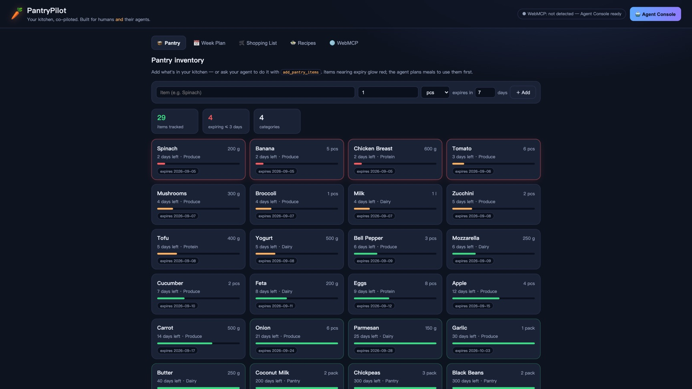
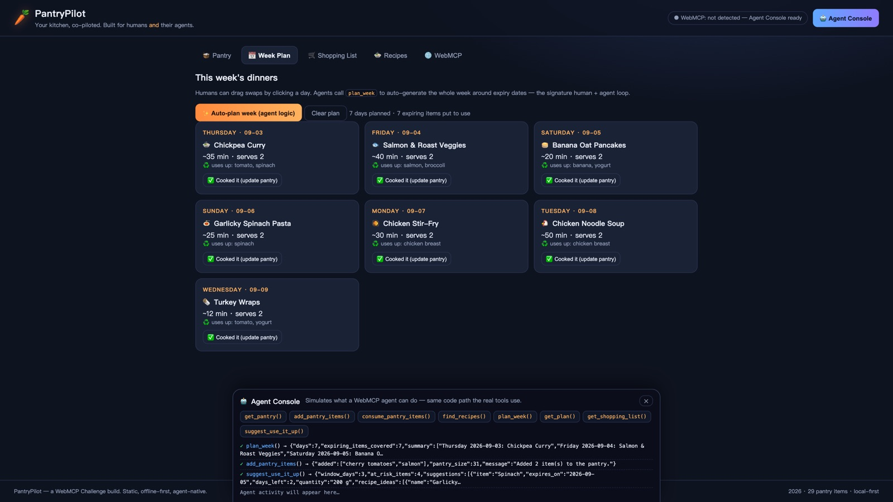
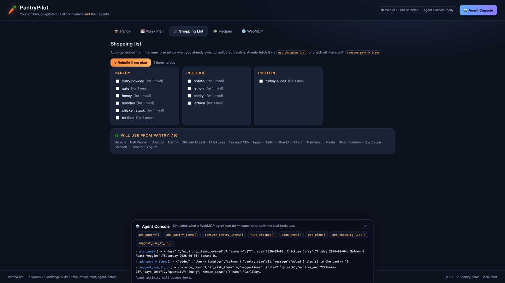

# 🥕 PantryPilot — Your kitchen, co-piloted

**PantryPilot is an agent-native kitchen app built for [The WebMCP Challenge](https://webmcp.devpost.com).** Humans stock the pantry and make the calls only humans should make; their AI agents do the bulk work — expiry triage, 7-day meal planning, and shopping-list consolidation — through structured [WebMCP](https://webmachinelearning.github.io/webmcp/) tools instead of guessing at the UI.





## The human + agent split

| Humans (tap/click) | Agents (WebMCP tools) |
|---|---|
| Confirm "this looks/tastes fine" | Bulk-add groceries after shopping |
| Adjust a day of the plan | Re-plan the whole week around expiry dates |
| Check off shopping items | Triage everything about to spoil |
| Decide preferences | Consolidate a list by supermarket aisle |

## WebMCP tools registered on `document.modelContext`

| Tool | What it does |
|---|---|
| `get_pantry()` | Full inventory with expiry dates and days-left |
| `add_pantry_items({items})` | Add groceries, merging duplicates |
| `consume_pantry_items({items})` | Decrement/remove items after cooking |
| `find_recipes({query?, ingredients?, max_missing?})` | Rank recipes by expiring-ingredient coverage |
| `plan_week()` | Generate 7 dinners prioritizing soon-expiring items |
| `get_plan()` | Read the current plan |
| `get_shopping_list()` | Missing ingredients for the plan, by aisle |
| `suggest_use_it_up({days?})` | Anti-waste triage + recipe ideas |

### The code

```js
document.modelContext.registerTool({
  name: "plan_week",
  description: "Plan 7 dinners around what is expiring first",
  inputSchema: { type: "object", properties: {} },
  execute: async (input) => Tools.plan_week(input)
});
```

## Try it

- **With an agent**: open the deployed URL in **ChatGPT's in-app browser**, or Chrome with `chrome://flags/#enable-webmcp-testing` enabled, then ask: *"Check what's expiring in my pantry, plan my week around it, and tell me what to buy."*
- **Anywhere else**: the built-in **Agent Console** (🤖 button) drives the exact same tool implementations, so the demo works in every browser.
- **Locally**: static site, no build step — `python3 -m http.server` in this folder and open `http://localhost:8000`. State persists in `localStorage`.

## Architecture

- **Zero dependencies, zero build step.** Plain HTML/CSS/JS, fully offline-capable.
- `js/app.js` — state + the shared tool implementations (single source of truth for both WebMCP and the console).
- `js/webmcp.js` — tool schemas + registration on `document.modelContext` (with fallbacks across engine variants) + the Agent Console.
- `js/data.js` — 36-recipe local recipe graph, seed pantry, ingredient→aisle mapping.
- Deterministic planning: greedy scoring — expiring ingredients weigh most, repeats are penalized, no randomness.

## Why WebMCP matters here

Food waste is a planning problem with *state* the agent must read and write. Without WebMCP an agent would have to scrape the DOM and click buttons — slow, fragile, wrong. With WebMCP the app publishes a typed contract (`inputSchema`) and structured results, so the same ask that took many UI turns becomes one tool call. The human stays in the loop where judgment matters; the agent handles the bulk where iteration count matters.

## License

MIT — see [LICENSE](LICENSE).
